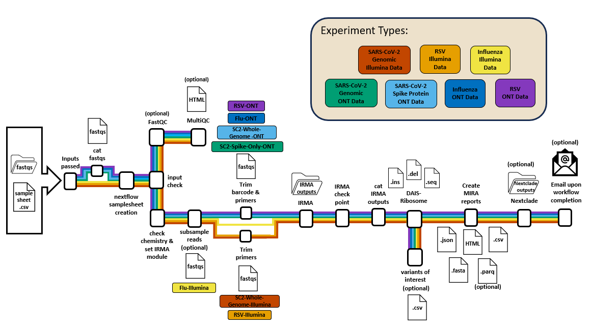

[](https://doi.org/10.5281/zenodo.XXXXXXX)

[](https://www.nextflow.io/)
[](https://www.docker.com/)
[](https://sylabs.io/docs/)
[](https://tower.nf/launch?pipeline=https://github.com/cdcgov/mira-nf)

#  MIRA-NF: A Nextflow Pipeline for Influenza, SARS-CoV-2 and RSV Assembly and Curation

**General disclaimer:** This repository was created for use by CDC programs to collaborate on public health related projects in support of the [CDC mission](https://www.cdc.gov/about/divisions-offices/index.html). GitHub is not hosted by the CDC, but is a third party website used by CDC and its partners to share information and collaborate on software. CDC use of GitHub does not imply an endorsement of any one particular service, product, or enterprise.

Use of this service is limited only to non-sensitive and publicly available data. Users must not use, share, or store any kind of sensitive data like health status, provision or payment of healthcare, Personally Identifiable Information (PII) and/or Protected Health Information (PHI), etc. under ANY circumstance.

Administrators for this service reserve the right to moderate all information used, shared, or stored with this service at any time. Any user that cannot abide by this disclaimer and Code of Conduct may be subject to action, up to and including revoking access to services.

The material embodied in this software is provided to you "as-is" and without warranty of any kind, express, implied or otherwise, including without limitation, any warranty of fitness for a particular purpose. In no event shall the Centers for Disease Control and Prevention (CDC) or the United States (U.S.) government be liable to you or anyone else for any direct, special, incidental, indirect or consequential damages of any kind, or any damages whatsoever, including without limitation, loss of profit, loss of use, savings or revenue, or the claims of third parties, whether or not CDC or the U.S. government has been advised of the possibility of such loss, however caused and on any theory of liability, arising out of or in connection with the possession, use or performance of this software.

# Introduction to Full Analysis Workflows

**cdcgov/mira-nf** is a bioinformatics pipeline that assembles Influenza genomes, SARS-CoV-2 genomes, the SARS-CoV-2 spike-gene and RSV genomes when given the raw fastq files and a samplesheet. cdcgov/mira-nf can analyze reads from both Illumina and OxFord Nanopore sequencing machines.

MIRA-NF performs these steps for genome assembly and curation:

1. Read QC (optional) ([`FastQC`](https://www.bioinformatics.babraham.ac.uk/projects/fastqc/))
2. Present QC for raw reads (optional) ([`MultiQC`](http://multiqc.info/))
3. Checking chemistry in fastq files (optional) ([`mira-oxide`](https://github.com/CDCgov/mira-oxide))
4. Subsampling to faster analysis (optional) ([`IRMA-core`](https://github.com/CDCgov/irma-core))
5. Trimming ([`IRMA-core`](https://github.com/CDCgov/irma-core))
6. Genome Assembly ([`IRMA`](https://wonder.cdc.gov/amd/flu/irma/))
7. Annotation of assembly ([`DAIS-ribosome`](https://hub.docker.com/r/cdcgov/dais-ribosome))
8. Collect results from IRMA and DAIS-Ribosome to create MIRA reoprts (JSON, HTML, FASTA, CSV and optional PARQ files)([`mira-oxide`](https://github.com/CDCgov/mira-oxide))
9. Nextclade (optional)([`Nextclade`](https://github.com/nextstrain/nextclade))

#### MIRA-NF is able to analyze 7 data types:

|   | Illumina | ONT |
|---|---|---|
| Influenza   |   🥳   |   🥳   |
| SARS-CoV-2 :: Whole Genome   |   🥳   |   🥳   |
| SARS-CoV-2 :: Spike-only   |   |   🥳   |
| RSV   |   🥳   |   🥳   |


*MIRA-NF workflows*

# Usage

> To run this pipeline you will need to have these programs installed:

1. Nextflow - If you are new to Nextflow and nf-core, please refer to [this page](https://nf-co.re/docs/usage/installation) on how to set-up Nextflow.
2. singularity-ce or docker - Information on how to install singularity-ce can be found [here](https://docs.sylabs.io/guides/4.1/user-guide/quick_start.html#quick-installation-steps) and information to install docker can be found [here](https://www.docker.com/). Docker must be running to use that profile.
3. git - Information about git installation can be found [here](<https://git-scm.com/book/en/v2/Getting-Started-Installing-Git>).

Make sure to [test your setup](https://nf-co.re/docs/usage/introduction#how-to-run-a-pipeline) with `-profile test,<singularity or docker>` to ensure that everything is installed properly before running the workflow on actual data. If you would like to further test the pipeline using our test data it can be downloaded from this link:

- Tiny test data from ONT Influenza genome and SARS-CoV-2-spike - 40Mb [Download](https://centersfordiseasecontrol.sharefile.com/d-s839d7319e9b04e2baba07b4d328f02c2).
- Full test data set - the data set from above + full genomes of Influenza and SARS-CoV-2 from Illumina MiSeqs 1 Gb [Download](<https://centersfordiseasecontrol.sharefile.com/d-s3c52c0b25c2243078f506d60bd787c62>).

To run this pipeline with the MIRA-NF setup:

First, prepare a samplesheet with your input data that looks as follows:

`samplesheet.csv`:

Illumina data should be set up as follows:

```csv
sample_id,sample_type
sample_1,Test
sample_2,Test
sample_3,Test
sample_4,Test
```
Each row represents a sample.

| Column     | Description                                                                                               |
|------------|-----------------------------------------------------------------------------------------------------------|
| `sample_id`  | Custom sample name. This entry must match the name associated with the paired reads. Convert all spaces in sample names to underscores (`_`).  |
| `sample_type` | The sample type for the given sample. Ex: test, - control, + control, etc.  |

Oxford Nanopore data should be set up as follows:

```csv
barcode,sample_id,sample_type
barcode07,s1,Test
barcode37,s2,Test
barcode41,s3,Test
```
Each row represents a sample.

| Column     | Description                                                                                               |
|------------|-----------------------------------------------------------------------------------------------------------|
| `barcode`  | The barcode used to create the ONT data for this sample. Must match the fold contain the fastq files associated with the sample. Single digit numbers must have 0 in front of them. Ex: barcode07  |
| `sample_id` | Custom sample name. Convert all spaces in sample names to underscores (`_`).  |
| `sample_type` | The sample type for the given sample. Ex: test, positive, negative, etc.  |

**Important things to note about samplesheet:**

- Sample names within the "Sample ID" column need to be unique.
- The headers must be named as seen above.
- Be sure that there are no empty lines at the end of the samplesheet.
- For Illumina samples be sure that you have read 1 and read 2 for all samples in samplesheet.
- Illumina fastq file must be in this format: {sample_id}_R1\*fastq\* or {sample_id}_R1\*fq\* AND {sample_id}_R2\*fastq\* or {sample_id}_R2\*fq\*

**To use the nextflow samplesheet setup please refer to the usage document (../assets/usage.md). USING THE NEXTFLOW SAMPLESHEET SET UP WITH ONT DATA WILL REQUIRE YOU TO COMBINE ONT FASTQS YOURSELF.**

Second, move samplesheet into a run folder with fastq files:

Illumina set up should be set up as follows:

1. <RUN_PATH>/fastqs <- all fastqs should be out at this level
2. <RUN_PATH>/samplesheet.csv

Oxford Nanopore set up should be set up as follows:

1. <RUN_PATH>/fastq_pass <- fastqs should be within barcode folders as given by ONT machine
2. <RUN_PATH>/samplesheet.csv

**Note:** The name of the run folder will be used to name outputs files.

Third, pull the mira-nf work flow from github using:

```bash
git clone https://github.com/CDCgov/MIRA-NF.git
cd MIRA-NF
```

Now, you can run the pipeline using two methods: locally or within a high computing cluster. In both cases you will need to launch the workflow from the mira-nf folder.

# Input Parameters for MIRA-NF Workflows

| Flag       | Description                                                                                               |
|------------|-----------------------------------------------------------------------------------------------------------|
| `profile`  | singularity, singularity_arm64, docker, docker_arm64, podman, podman_arm64, local, sge, slurm. You can use docker, podman or singularity. Use local for running on local computer and sge or slurm for HPC's.   |
| `input`    | `<RUN_PATH>/samplesheet.csv` with the format described above. The full file path is required.                         |
| `outdir`   | The file path to where you would like the output directory to write the files. The full file path is required.        |
| `runpath`  | The `<RUN_PATH>` where the samplesheet is located. Your fastq_folder and samplesheet.csv should be in here. The full file path is required. |
| `e`        | Experiment type, options: Flu-ONT, SC2-Spike-Only-ONT, Flu-Illumina, SC2-Whole-Genome-ONT, SC2-Whole-Genome-Illumina, RSV-Illumina, RSV-ONT, Find-Variants-Of-Interest, Find-Positions-Of-Interest |

### *all commands listed below can not be included in run command and the defaults will be used, aside from the p flag that must be used with SC2 and RSV pipelines*

| Flag       | Description                                                                                               |
|------------|-----------------------------------------------------------------------------------------------------------|
| `p`                   | Provide a built-in primer schema if using experiment type SC2-Whole-Genome-Illumina. SARS-CoV-2 options: articv3, articv4, articv4.1, articv5.3.2, qiagen, swift, swift_211206. RSV options: RSV_CDC_8amplicon_230901 **Will be overwritten by custom_primers flag if both flags are provided** |
| `custom_primers`      | Provide a custom primer schema by entering the file path to your own custom primer fasta file. Must be fasta formatted. **primer_kmer_len and primer_restrict_window flags must also be used with this flag**                      |
| `primer_kmer_len`     | When primer_kmer_len is set to K, all K-mers for the primers are stored and matching against K-mers in the queries (reads) is performed.                                                                                          |
| `primer_restrict_window` | The N number of bases provided by this flag will restrict them primer searching to the leftmost and rightmost N bases.                                                                                                           |
| `read_qc`             | (optional) Run FastQC and MultiQC. Default: false.                                                                                                                                                                                |
| `parquet_files`       | (optional) Flag to create parquet files from the csv file formats (boolean). Default set to false.                                                                                                                        |
| `subsample_reads`     | (optional) The number of reads that used for subsampling. Paired reads for Illumina data and single reads for ONT data. Default is set to skip subsampling process using value 0.                                                  |
| `process_q`           | (required for age or slurm profile) Provide the name of the processing queue that will submit to the queue.                                                                                                                                |
| `email`               | (optional) Provide an email if you would like to receive an email with the irma summary upon completion.
| `nextclade`        | (optional) When set to true, this flag will run nextclade for your passing samples. Default: false.                                                       |
| `irma_module`         | (optional) Call flu-sensitive, flu-secondary or flu-utr irma module instead of the built-in flu configs. Default is set to not use these modules and they can only be invoked for Flu-Illumina experiment type. Options: sensitive, secondary or utr |
| `custom_irma_config`  | (optional) Provide a custom IRMA config file to be used with IRMA assembly. File path to file needed.                                                                                                                             |
| `custom_qc_settings`  | (optional) Provide custom qc pass/fail settings for constructing the summary files. Default settings can be found in ../bin/irma_config/qc_pass_fail_settings.yaml. File path to file needed.                                     |
| `amd_platform`        | (optional) This flag allows the user to skip the "Nextflow samplesheet creation" step. It will require the user to provide a different samplesheet that is described under "Nextflow samplesheet setup" in the usage.md document. Please read the usage.md fully before implementing this flag. Default false. Options true or false |
| `ecr_registry`        | (optional) Allows a user to pass their ecr registry for AWS to the workflow.                                                                                                                                                      |
| `sourcepath`          | (optional) If sourcepath flag is given, then it will use the sourcepath to point to the reference files, primer fastas and support files in all trimming modules, prepareIRMAjson and staticHTML. This flag is for if one cannot place the entire repo in their working directory. |
| `variants_of_interest`  | (optional) Providing this flag will run the [find_variants_of_interest](docs/find_variants_of_interest_docs/) module within the MIRA-nf workflow. This module will provide the codon and amino acid differences at the specified postions. The user should provide the `<FILE_PATH>/variants_of_interest.txt` with the format described [here](docs/find_variants_of_interest_docs/). The full file path is required. Note that dais_module will not need to be provided in this case. |
| `positions_of_interest`  | (optional) Providing this flag will run the [find_positions_of_interest](docs/find_positions_of_interest_docs/) module within the MIRA-nf workflow. This module will provide the all codon and amino acid allelles at the specified postions whether they differ between sample and reference or not. The the user should provide the `<FILE_PATH>/positions_of_interest.txt` with the format described [here](docs/find_postions_of_interest_docs/). The full file path is required. Note that dais_module will not need to be provided in this case. |
| `reference_seq_table`        | (optional) Providing this flag will run the [find_variants_of_interest](docs/find_variants_of_interest_docs/) module within the MIRA-NF workflow. Here the user should provide the  `<FILE_PATH>/reference_table.txt` with the format described [here](docs/find_variants_of_interest_docs/). The full file path is required. Note that dais_module will not need to be provided in this case.  |
specific
| `check_version`        | (optional) The flag is set to true by default. It will check that you are using the most up to date version of MIRA-NF. However, it will require that you have an internet connection to check. If you do not have internet, then the flag should be set to false.  |

To run locally you will need to install Nextflow and singularity-ce or docker on your computer (see links above for details) or you can use an interactive session on an hpc. The command will be run as seen below:

```bash
nextflow run ./main.nf \
   -profile singularity,local \
   --input <RUN_PATH>/samplesheet.csv \
   --outdir <OUTDIR> \
   --runpath <RUN_PATH> \
   --e <EXPERIMENT_TYPE> \
   --p <PRIMER_SCHEMA> (optional) \
   --subsample_reads <READ_COUNT> (optional)\
   --parquet_files true (optional) \
   --read_qc false (optional) \
```

To run in a high computing cluster you will need to add sge or slurm to the profile and provide a queue name for the queue that you would like jobs to be submitting to:

```bash
nextflow run ./main.nf \
   -profile singularity,sge \
   --input <RUN_PATH>/samplesheet.csv \
   --outdir <OUTDIR> \
   --runpath <RUN_PATH> \
   --e <EXPERIMENT_TYPE> \
   --p <PRIMER_SCHEMA> (optional) \
   --process_q <QUEUE_NAME> \
   --parquet_files true (optional) \
   --email <EMAIL_ADDRESS> (optional) \
   --read_qc false (optional)
```

For running MIRA-NF in AWS, example parameter json files for all data types can be found under ../samples/examples.

For in house testing:

```bash
qsub MIRA_nextflow.sh \
   -d <FILE_PATH_TO_MIRA-NF_DIR> \
   -f singularity,sge \
   -i <RUN_PATH>/samplesheet.csv \
   -o <OUTDIR> \
   -r <RUN_PATH> \
   -e <EXPERIMENT_TYPE> \
   -p <PRIMER_SCHEMA> \ (optional- cannot use with custom_primers flag)
   -g <FILE_PATH>/custom_primer.fasta \ (optional - cannot use with p flag)
   -t <PRIMER_KMER_LEN> \ (used with custom primers flag)
   -u <PRIMER_RESTRICT_WINDOW> \ (used with custom primers flag)
   -q <QUEUE_NAME> \
   -a <PARQUET_FILES> \ (optional)
   -c <SUBSAMPLED_READ_COUNTS> \ (optional)
   -b <OTHER_IRMA_MODULE> (optional)
   -m <EMAIL_ADDRESS> \ (optional)
   -k <READ_QC> \ (optional)

```

Note that pipeline parameters can be provided via the NF or Nextflow `-params-file` option. Custom config files including those provided by the `-c` Nextflow option can be used to provide any configuration ***except for parameters***; see [docs](https://nf-co.re/usage/configuration#custom-configuration-files).

# MIRA-NF Utility Workflows

- [find_variants_of_interest](docs/find_variants_of_interest_docs/) - Will run (or rerun) the DAIS-ribosome and finding variants of interest part of the workflow.

## Credits

cdcgov/mira-nf is developed and maintained by Amanda Sullivan (maintainer), Kristine Lacek, Reina Chau, Sam Wiley and Ben Rambo-Martin (lead).

## Citations

An extensive list of references for the tools used by the pipeline can be found in the [`CITATIONS.md`](CITATIONS.md) file.

This pipeline uses code and infrastructure developed and maintained by the [nf-core](https://nf-co.re) community, reused here under the [MIT license](https://github.com/nf-core/tools/blob/main/LICENSE).

> **The nf-core framework for community-curated bioinformatics pipelines.**
>
> Philip Ewels, Alexander Peltzer, Sven Fillinger, Harshil Patel, Johannes Alneberg, Andreas Wilm, Maxime Ulysse Garcia, Paolo Di Tommaso & Sven Nahnsen.
>
> *Nat Biotechnol.* 2020 Feb 13. doi: [10.1038/s41587-020-0439-x](https://dx.doi.org/10.1038/s41587-020-0439-x).

## Public Domain Standard Notice

This repository constitutes a work of the United States Government and is not
subject to domestic copyright protection under 17 USC § 105. This repository is in
the public domain within the United States, and copyright and related rights in
the work worldwide are waived through the [CC0 1.0 Universal public domain dedication](https://creativecommons.org/publicdomain/zero/1.0/).
All contributions to this repository will be released under the CC0 dedication. By
submitting a pull request you are agreeing to comply with this waiver of
copyright interest.

## License Standard Notice

The repository utilizes code licensed under the terms of the Apache Software
License and therefore is licensed under ASL v2 or later.

This source code in this repository is free: you can redistribute it and/or modify it under
the terms of the Apache Software License version 2, or (at your option) any
later version.

This source code in this repository is distributed in the hope that it will be useful, but WITHOUT ANY
WARRANTY; without even the implied warranty of MERCHANTABILITY or FITNESS FOR A
PARTICULAR PURPOSE. See the Apache Software License for more details.

You should have received a copy of the Apache Software License along with this
program. If not, see <http://www.apache.org/licenses/LICENSE-2.0.html>

The source code forked from other open source projects will inherit its license.

## Privacy Standard Notice

This repository contains only non-sensitive, publicly available data and
information. All material and community participation is covered by the
[Disclaimer](DISCLAIMER.md)
and [Code of Conduct](code-of-conduct.md).
For more information about CDC's privacy policy, please visit [http://www.cdc.gov/other/privacy.html](https://www.cdc.gov/other/privacy.html).

## Contributing Standard Notice

Anyone is encouraged to contribute to the repository by [forking](https://help.github.com/articles/fork-a-repo)
and submitting a pull request. (If you are new to GitHub, you might start with a
[basic tutorial](https://help.github.com/articles/set-up-git).) By contributing
to this project, you grant a world-wide, royalty-free, perpetual, irrevocable,
non-exclusive, transferable license to all users under the terms of the
[Apache Software License v2](http://www.apache.org/licenses/LICENSE-2.0.html) or
later.

All comments, messages, pull requests, and other submissions received through
CDC including this GitHub page may be subject to applicable federal law, including but not limited to the Federal Records Act, and may be archived. Learn more at [http://www.cdc.gov/other/privacy.html](http://www.cdc.gov/other/privacy.html).

## Records Management Standard Notice

This repository is not a source of government records, but is a copy to increase
collaboration and collaborative potential. All government records will be
published through the [CDC web site](http://www.cdc.gov).

## Additional Standard Notices

Please refer to [CDC's Template Repository](https://github.com/CDCgov/template) for more information about [contributing to this repository](https://github.com/CDCgov/template/blob/main/CONTRIBUTING.md), [public domain notices and disclaimers](https://github.com/CDCgov/template/blob/main/DISCLAIMER.md), and [code of conduct](https://github.com/CDCgov/template/blob/main/code-of-conduct.md).
