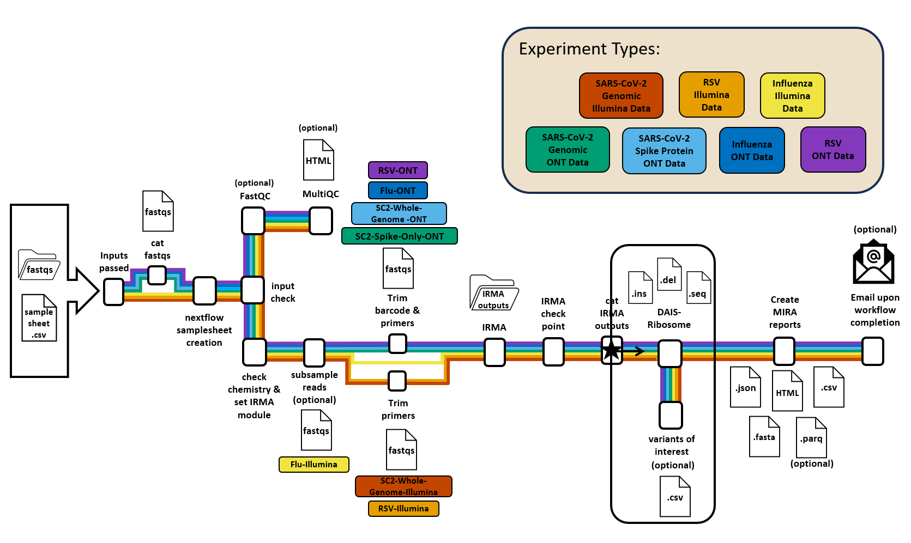

# MIRA's Find Variants of Interest Tool

The **find_variants_of_int** workflow is a handy tool that runs (or reruns) DAIS-ribosome and the find_variants_of_interest module. The module will return codon differences and amino acid differences  at the postions of interest that the user provides.

To get started, you'll need to provide the DAIS-ribosome input, a reference table, and a variants of interest table. Once it's done, you'll get a CSV file that lists all the positions in your input sequences that match the variants you're interested in from the variants of interest table you provided. Check out the info below for more details about how it works.


*find_variants_of_int workflow*

### The DAIS-ribosome input

The input file for this workflow is a concatenated FASTA file with assembled sequences from all of your samples. If you've run the MIRA pipeline, you'll find this input file named DAIS_ribosome_input.fasta in the dais-ribosome folder within the aggregate outputs.

### The reference table input should be structured like this:
The reference table can be made by running your reference genomes through DAIS-ribosome and selecting the column found below. The file needs to be tab delimited. An example using Flu genomes can be seens below.

```
isolate_id	isolate_name	subtype	passage_history	nt_id	ctype	reference_id	protein	aa_aln	cds_aln
EPI_ISL_25690	A/common magpie/Hong Kong/5052/2007	A / H5N1		2b14fd2e8f738834298e9099f00e59d020ffc552	A_HA_H5	VT1203	HA-signal	.....LLFAIVSLVKS	...............CTTCTTTTTGCAATAGTCAGCCTTGTTAAAAGC
EPI_ISL_140	A/Hong Kong/1073/99	A / H9N2		a591bc9ad3a54f705940ad8483684cfc278c742c	A_HA_H9	BGD0994	HA-signal	METISLITILLVVTASNA	ATGGAAACAATATCACTAATAACTATACTACTAGTAGTAACAGCAAGCAATGCA

```

### The known variants of interest table input should be structured like this:
The variants of interest table should be structured as seen below. These should be variants you would be interested in if they were present within your samples. The file must be tab delimited.

```
subtype	protein position    mutation_of_int phenotypic_consensus
A / H1N1	HA	7	H	 inference description
A / H1N1	HA	8	Q	 inference description
A / H1N1	HA	94	N	inference description
A / H1N1	HA	121	N	inference description
B	HA	94	N	inference description
B	HA	121	N	inference description
```

# Input Parameters for din_variants_of_interest Workflow

| Flag       | Description                                                                                               |
|------------|-----------------------------------------------------------------------------------------------------------|
| `profile`  | singularity, docker, local, sge, slurm. You can use docker or singularity. Use local for running on local computer.   |
| `input`    | `<FILE_PATH>/DAIS_ribosome_input.fasta` with the format described above. The full file path is required.                         |
| `outdir`   | The file path to where you would like the output directory to write the files. The full file path is required.        |
| `variants_of_interest`  | The `<FILE_PATH>/variants_of_interest.txt` with the format described above. The full file path is required. |
| `reference_seq_table`        | The `<FILE_PATH>/reference_table.txt` with the format described above. The full file path is required.  |
| `dais_module`        | The dais_module that will be used by DAIS-ribosome. Options: INFLUENZA, BETACORONAVIRUS, RSV |

### *all commands listed below can not be included in run command and the defaults will be used, aside from the p flag that must be used wit hSC2 and RSV pipelines*

| Flag       | Description                                                                                               |
|------------|-----------------------------------------------------------------------------------------------------------|
| `process_q`           | (required for hpc profile) Provide the name of the processing queue that will submit to the queue.                                                                                                                                |
| `email`               | (optional) Provide an email if you would like to receive an email with the irma summary upon completion.

To run the workflow you will use the command below:

```bash
nextflow run ./main.nf \
   -profile <profile> \
   --input <RUN_PATH>/samplesheet.csv \
   --outdir <OUTDIR> \
   --runpath <RUN_PATH> \
   --e Find-Variants-Of-Interest \
   --variants_of_interest <filepath>/muts_of_int_table.txt \
   --reference_seq_table <filepath>/ref_table.txt \
   --dais_module <DAIS_MODULE> \
   --process_q <QUEUE_NAME> \
   --email <EMAIL_ADDRESS> (optional) \
```

## Output Layout
```
sample, reference_strain,gisaid_accession,ctype,dais_reference,protein,sample_codon,reference_codon,aa_mutation,phenotypic_consequence
s3_3,A/California/07/2009,EPI_ISL_227813,A_PA,HK4801,PA,ATA,ATT,I:38:I,
s4_3,A/California/07/2009,EPI_ISL_227813,A_PA,HK4801,PA,ATA,NNN,I:38:X,amino acid information missing
```
