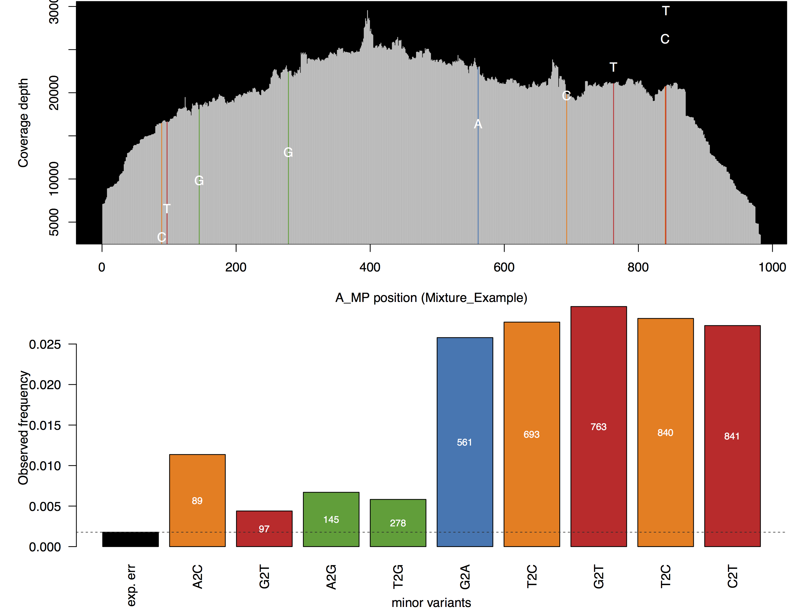

# cdcgov/mira-nf: Output

## Introduction

This document describes the output produced by the pipeline. Most of the plots are taken from the MultiQC report, which summarizes results at the end of the pipeline.

The directories listed below will be created in the results directory after the pipeline has finished. All paths are relative to the top-level results directory.

## Pipeline overview

The pipeline is built using [Nextflow](https://www.nextflow.io/) and processes data using the following steps:

- [FastQC](#fastqc) - Raw read QC
- [MultiQC](#multiqc) - Aggregate report describing results and QC from the whole pipeline
- [Pipeline information](#pipeline-information) - Report metrics generated during the workflow execution
- [Reads Prepped for IRMA](#reads-prepped-for-irma) - The subsampled and trimmed fastq inputs that IRMA will use for assembly
- [IRMA](#irma-outputs) - A folder containing all of the outs made by IRMA
- [DAIS-ribosome](dais-ribosome-outputs) - Aggregate insertion, deletion and sequence file for the input data
- [prepareIRMAjson](#prepare-IRMA-json) - Collected results from IRMA and DAIS-Ribosome in json files
- [statichtml](#static-html) - Create html files, excel files and amended consensus fasta files
- [parquetmaker`](#parquet-maker) - Excels and amended consensus fasta converted parquet files for importing into a database

## Output Structure

```bash
|---outputs
    |---aggregate_outputs
        |---multiqc  (when applicable) --> multiqc outputs
        |---dais-ribosome -> dais inputs and outputs
        |---dash-json -> json files
        |---mira-reports -> the aggregated fasta files and html files
        |---csv-reports -> CSV summary files
        |---parquet-reports (when applicable)
    |---Sample_ID
        |---subsampled-reads (when applicable) -> fastqs and log files
        |---barcode-trimmed-reads (when applicable) -> fastqs and log files
        |---primer-trimmed-reads (when applicable) -> fastqs and log files
        |---IRMA/Sample_ID -> IRMA outputs and log files
        |---IRMA-negative (when applicable)
    |---fastq_pass -> ONT data only – concatenated fastqs
    |---pipeline_info -> execution reports
```

### MultiQC

<details markdown="1">
<summary>Output files</summary>

- `aggregate_outputs/multiqc/`
  - `multiqc_report.html`: a standalone HTML file that can be viewed in your web browser.
  - `multiqc_data/`: directory containing parsed statistics from the different tools used in the pipeline.
  - `multiqc_plots/`: directory containing static images from the report in various formats.

</details>


:::note
The FastQC plots displayed in the MultiQC report shows _untrimmed_ reads. They may contain adapter sequence and potentially regions with low quality.
:::

[MultiQC](http://multiqc.info) is a visualization tool that generates a single HTML report summarizing all samples in your project. Most of the pipeline QC results are visualised in the report and further statistics are available in the report data directory.

Results generated by MultiQC collate pipeline QC from supported tools e.g. FastQC. The pipeline has special steps which also allow the software versions to be reported in the MultiQC output for future traceability. For more information about how to use MultiQC reports, see <http://multiqc.info>.

### Pipeline information

<details markdown="1">
<summary>Output files</summary>

- `pipeline_info/`
  - Reports generated by Nextflow: `execution_report.html`, `execution_timeline.html`, `execution_trace.txt` and `pipeline_dag.dot`/`pipeline_dag.svg`.
  - Reports generated by the pipeline: `pipeline_report.html`, `pipeline_report.txt` and `software_versions.yml`. The `pipeline_report*` files will only be present if the `--email` / `--email_on_fail` parameter's are used when running the pipeline.
  - Reformatted samplesheet files used as input to the pipeline: `samplesheet.valid.csv`.
  - Parameters used by the pipeline run: `params.json`.

</details>

### Reads Prepped for IRMA

<details markdown="1">
<summary>Output files</summary>

- `sample_id/subsampled-reads`
  - Subsampled read in fastq file
- `sample_id/barcode-trimmed-reads`
  - barcode trimmed reads in fastq files for those experiment types that require trimming
- `sample_id/primer-trimmed-reads`
  - primer trimmed reads in fastq files for those experiment types that require trimming

</details>

### IRMA

<details markdown="1">
<summary>Output folder with sample name</summary>

`sample_id/IRMA/sample_id`

IRMA output directory structure (only showing A_MP)

- `amended_consensus/`
  - Mixture_Example_7.fa - amended consensus
  - Mixture_Example_7.a2m - Optional amended global alignment to profile HMM
  - Mixture_Example_7.pad.fa - Optional N-padded consensus for amplicon dropouts.

- `figures/`
  - A_MP-coverageDiagram.pdf - Shows coverage and variant calls
  - A_MP-heuristics.pdf - Heuristic graphs for A_MP
  - A_MP-EXPENRD.pdf - A_MP variant phrasing using normalized joint probability distances
  - A_MP-JACCARD.pdf - A_MP variant phasing using modified Jaccard distances
  - A_MP-MUTUALD.pdf - A_MP variant phasing using mutual association distances
  - A_MP-NJOINTP.pdf - A_MP variant phasing using normalized joint probability distances
  - READ_PERCENTAGES.pdf - Break down or reads assembled

- `intermediate/`
  - `0-ITERATIVE-REFERENCES/`
  - R0-A_MP.ref - Starting reference library sequence for A_MP
  - R1-A_MP.ref - Working reference for A_MP after round 1, template for round 2
  - R2-A_MP.ref - Working reference for A_MP after round 2
  - `1-MATCH_BLAT/`
  - R1-tar.gz - Archive of BLT results for the MATCH step
  - R2-tar.gz - Archive of BLT results for the MATCH step
  - R3-tar.gz - Archive of BLT results for the MATCH step
  - `2-SORT_BLAT/`
  - R1.tar.gz - Classification/sorting intermediate files for round 1
  - R1.txt - Summary statistics of sorting results for round 1
  - R2.tar.gz - Classification/sorting intermediate files for round 2
  - R2.txt - Summary statistics of sorting results for round 2
  - `3-ALIGN_SAM/`
  - storedCounts.tar.gz - Static files used to create rough assembly consensus sequences
  - `4-ASSEMBLE_SSW/`
  - F1-A_MP.bam - Unsorted BAM file for A_MP assembly, iteration 1
  - F1-A_MP.ref - Reference for final assembly, A_MP, iteration 1
  - F2-A_MP.bam - Unsorted BAM file for A_MP assembly, iteration 2
  - F2-A_MP.ref - Reference for final assembly, A_MP, iteration 2
  - reads.tar.gz - Archive of sorted, unmerged reads by gene segment

- `logs/`
  - ASSEMBLY_log.txt SSW scores per all rounds tried in the iterative refinement
  - NR_COUNTS_log.txt - Read pattern counts at various stages
  - QC_log.txt - Quality control output
  - READ_log.txt - Counts of assembled reads from BAM files
  - FLU-Mixture_EXample.sh - Configuration files corresponding to this IRMAS run
  - run_info.txt - Table of parameters used by the IRMA run

- `matrices/`
  - A_MP-EXPENRD.sqm - log file for normalized joint probability phasing
  - A_MP-JACCARD.sqm - log file for jaccard phasing
  - A_MP-MUTUALD.sqm - log file for mutual association phasing
  - A_MP-NJOINTP.sqm - log file for normalized joint probability phasing

- `secondary/`
  - R1-A_NA_N1.fa - Trace A_NA_N1 sorted into secondary status
  - R1-UNRECOGNIZABLE.fa - Read patterns that matched flu but had poor signal according to LABEL
  - R2-UNRECOGNIZABLE.fa - Read patterns that matched flu but had poor signal according to LABEL
  - unmatched_read_patterns.tar.gz - Archive of left over read patterns that did not match FLU

  - `tables/`
    - A_MP-pairingStats.txt - Summary of paired-end merging statistics, if applicable, A_MP
    - A_MP-coverage/txt - Summary coverage statistics for the assembly, A_MP
    - A_MP-coverage.a2m.txt - Optional coverage statistics for plurality consensus globally aligned to profile HMM
    - A_MP-coverage.pad.txt - Optional coverage statistics for padded plurality consensus globally aligned to profile HMM
    - A_MP-allAlleles.txt - Statistics for every position & allele in the assembly, A_MP
    - A_MP-insertions.txt - Called insertion variants for A_MP
    - A_MP-deletions.txt -Called deletion variant for A_MP
    - A_MP-variants.txt - Called single nucleotide variants for A_MP
    - READ_COUNTS.txt - Read counts for various points in the assembly process

- A_MP.bam - Sorted BAM file for the final A_MP assembly (merged if applicable)
- A_MP.bam.bai - BAM file index for A_MP assembly
- A_MP.fasta - Final assembled plurality consensus (no mixed base calls) for A_MP
- A_MP.a2m - Optional plurality consensus aligned to profile HMM
- A_MP.VCF - Custom variant call file for called IRMA variants, A_MP

  - `residual_assembly/` - Optional residual assembly results
  - `secondary_assembly/` - Optional secondary assembly results

</details>

The output for IRMA is written into the working directory as a new subfolder. This subfolder is named using the sample name. Above are the typical outputs created by IRMA. These outputs include an amended consensus, variant information and coverage information.


Coverage figure created by IRMA

### DAIS-ribosome

<details markdown="1">
<summary>Output files</summary>

- `aggregate_outputs/dais-ribosome/`
  - DAIS_ribosome_input.fasta - input fasta files that is used as the input for DAIS-ribosome
  - DAIS_ribosome.in - file contains the insertion found in all the samples assembled by IRMA
  - DAIS_ribosome.del - file contains the deletions found in all the samples assembled by IRMA
  - DAIS_ribosome.seq - file contains sequence related data from all the samples assembled by IRMA

</details>

Aggregate insertion, deletion and sequence file for the input data

An insertion file output example:

| ID | C_type | Ref_ID | Protein | Upstream_aa | Inserted_nucleotides | Inserted_residues | Upstream_nt | Codon_shift |
| ------ | ------ | ------ | ------ | ------ | ------ | ------ | ------ | ------ |
| 11209 | B_HA | PHUKET3073 | HA | 161 | aaa | K | 483 | 0 |
| 154957 | B_HA | PHUKET3073 | HA | 163 | krc | X | 489 | 0 |
| 223550 | B_HA | PHUKET3073 | HA | 161 | caa | Q | 483 | 0 |

A deletion file example:

| ID | C_type | Ref_ID | Protein | VH | Del_AA_start | Del_AA_end | Del_AA_len | In_frame | CDS_ID | Del_CDS_start | Del_CDS_end | Del_CDS_len |
| ------ | ------ | ------ | ------ | ------ | ------ | ------ | ------ | ------ | ------ | ------ | ------ | ------ |
|EPI_ISL_410721|SARS-CoV-2|WUHAN19|orf1ab|5ba70e95c9a3251bc6155f62295dd3e8|994|1002|9|true|29cd767e2d144c31179395fd606d1489ce731746|2980|3006|27|
|EPI_ISL_410721|SARS-CoV-2|WUHAN19|orf1ab|5ba70e95c9a3251bc6155f62295dd3e8|1012|1012|1|true|29cd767e2d144c31179395fd606d1489ce731746|3034|3036|3|
|EPI_ISL_410721|SARS-CoV-2|WUHAN19|S|450c068c437e7536d27fdb883d95d4f4|72|72|1|true|36a75a0d34960c048abaf82ee46a1b713eee534e|214|216|3|
|EPI_ISL_410721|SARS-CoV-2|WUHAN19|S|450c068c437e7536d27fdb883d95d4f4|146|146|1|true|36a75a0d34960c048abaf82ee46a1b713eee534e|436|438|3|
|EPI_ISL_410721|SARS-CoV-2|WUHAN19|S|450c068c437e7536d27fdb883d95d4f4|254|256|3|true|36a75a0d34960c048abaf82ee46a1b713eee534e|760|768|9|
|EPI_ISL_410721|SARS-CoV-2|WUHAN19|S|450c068c437e7536d27fdb883d95d4f4|680|683|4|true|36a75a0d34960c048abaf82ee46a1b713eee534e|2038|2049|12|

A sequence file output example:

| ID | C_type | Ref_ID | Protein | VH |  AA_seq | AA_aln | CDS_id | Insertion | Shift_Insert | CDS_seq | CDS_aln | Query_nt_coordinates | CDS_nt_coordinates |
| ------ | ------ | ------ | ------ | ------ | ------ | ------ | ------ | ------ | ------ | ------ | ------ | ------ | ------ |
| 223550 | B_HA | BRISBANE60 | HA-signal | e81d2d895c70e91bb3ef917fe49fdab7 | MKAIIVLLMVVTSNA | MKAIIVLLMVVTSNA | 2aa6443b92ca45b301faa4d46e5fbd3b010e3ab7 |  false | false |ATGAAGGCAATAATTGTACTACTCATGGTAGTAACATCCAATGCA | ATGAAGGCAATAATTGTACTACTCATGGTAGTAACATCCAATGCA | 20..64 | 1..45 |
| 223550 | B_HA | PHUKET3073 | HA-signal | e81d2d895c70e91bb3ef917fe49fdab7 | MKAIIVLLMVVTSNA | MKAIIVLLMVVTSNA | 2aa6443b92ca45b301faa4d46e5fbd3b010e3ab7 | false | false | ATGAAGGCAATAATTGTACTACTCATGGTAGTAACATCCAATGCA | ATGAAGGCAATAATTGTACTACTCATGGTAGTAACATCCAATGCA | 20..64 | 1..45 |
| 11209 | B_HA | BRISBANE60 | HA-signal | c7ee7ff234abf5c0591e0fe1af26ca87 | MKAIIILLMVVTSNA | MKAIIILLMVVTSNA | c49a73ab7280362c8c710abbf648708c41f97712 | false | false | ATGAAGGCAATAATTATACTACTCATGGTAGTAACATCCAATGCA | ATGAAGGCAATAATTATACTACTCATGGTAGTAACATCCAATGCA | 1..45 | 1..45 |
| 11209 | B_HA | PHUKET3073 | HA-signal | c7ee7ff234abf5c0591e0fe1af26ca87 | MKAIIILLMVVTSNA | MKAIIILLMVVTSNA | c49a73ab7280362c8c710abbf648708c41f97712 | false | false | ATGAAGGCAATAATTATACTACTCATGGTAGTAACATCCAATGCA | ATGAAGGCAATAATTATACTACTCATGGTAGTAACATCCAATGCA | 1..45 | 1..45 |

### prepareIRMAjson

<details markdown="1">
<summary>Output files</summary>

- `aggregate_outputs/dash_json/`
  - alleles.json
  - barcode_distribution.json
  - coveragefig_sample_#_linear.json
  - coverage.json
  - dais_vars.json
  - heatmap.json
  - indels.json
  - irma_summary.json
  - nt_sequences.json
  - pass_fail_heatmap.json
  - pass_fail_qc.json
  - qc_statement.json
  - readsfig_sample_#.json
  - reads.json
  - ref_data.json
  - vtpye.json

</details>

The collected results from IRMA and DAIS-Ribosome in json files

### Statichtml

<details markdown="1">
<summary>Output files</summary>

- `aggregate_outputs/mira-reports`
  - mira_run_name_amended_consensus.fasta
  - mira_run_name_failed_amended_consensus.fasta
  - mira_run_name_amino_acid_consensus.fasta
  - mira_run_name_failed_amino_acid_consensus.fasta
  - mira_sample_#_coverage.html
  - mira_run_name_summary.html

</details>

 Html files, excel files and combined amended consensus fasta files are created in this step.

 Explanations of the summary HTML for Illumina data can be found here: <https://cdcgov.github.io/MIRA/articles/running-mira-cli-illumina.html#mira-cli-ouputs>
 Explanations of the summary HTML for ONT data can be found here: <https://cdcgov.github.io/MIRA/articles/running-mira-cli-ont.html>

### parquetmaker

Convert into csv files
<details markdown="1">
<summary>Output files</summary>

- `aggregate_outputs/csv-files/`
  - mira_run_name_aavars.csv
  - mira_run_name_alleles.csv
  - mira_run_name_amended_consensus.csv
  - mira_run_name_amino_acid_consensus.csv
  - mira_run_name_coverage.csv
  - mira_run_name_indels.csv
  - mira_run_name_irma_config.csv
  - mira_run_name_reads.csv
  - mira_run_name_samplesheet.csv
  - mira_run_name_summary.csv
  - mira_run_name_variants.csv

</details>

[Nextflow](https://www.nextflow.io/docs/latest/tracing.html) provides excellent functionality for generating various reports relevant to the running and execution of the pipeline. This will allow you to troubleshoot errors with the running of the pipeline, and also provide you with other information such as launch commands, run times and resource usage.
